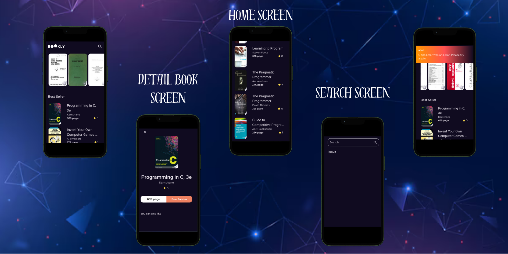

# *Bookly App* 📚💳

Welcome to *Bookly App* 🌟📚! This app is your ultimate companion for discovering, exploring, and purchasing programming books! Whether you are a beginner or a seasoned developer, **Bookly App** ensures a seamless and enjoyable book browsing experience with its rich features and intuitive interface. 🚀📏

With *Bookly*, you can easily browse through a curated collection of the best programming books, view detailed information, and even explore related titles. Ready to find your next read or build your personal library? Let’s dive in! 🎉

---

## *🌟 Features 🌟*
### 1. Splash Screen 🌟

Experience a smooth and welcoming entry into the Bookly App with our beautifully designed splash screen! 🌟✨

### 2. *Book Collection Overview* 📖

Explore a vast collection of programming books across different genres and technologies:

- *Programming Languages:* Python, JavaScript, Java, C++, and more. 📝🤖  
- *Frameworks and Libraries:* React, Angular, Django, Flask, etc. 🔄🌐 
- *Specialized Topics:* Machine Learning, Data Science, Web Development, Mobile Development, and more. 🧬🚀

---

### 3. *Detailed Book Information* 📘

Get comprehensive details for each book:

- *Title and Author:* View the book’s title and author to help you decide. 📕👨‍📚  
- *Book Rating:* See user ratings and reviews to find the best options. 🌟⭐ 
- *Price:* Easily view the price and purchase options. 💳💸  
- *Description:* Read a detailed description to understand what the book covers. 📝

---

### 4. *Related Books Suggestions* 📚🌟

Discover similar books based on your interests:

- *Recommendations:* Get personalized recommendations based on the books you view. 🤖🔎 
- *Popular Books:* Browse the most popular titles in various categories. 🌟📖  
- *New Arrivals:* Stay updated with the latest additions to the collection. 📖📝

---

### 5. *Search and Filter* 🔎🔃

Quickly find books with powerful search and filtering options:

- *Search by Title/Author:* Enter keywords to find specific books or authors. 🔎📚  
- *Filter by Category:* Narrow down results by language, framework, or topic. 🔄⚙️  
- *Sort by Rating/Price:* Choose how you want to view results—by highest rating or lowest price. 🌟💸

---

### 6. *Book Reviews and Ratings* 📝⭐

See what other readers think before making your choice:

- *User Reviews:* Read detailed reviews to get insights from other developers. 📚🧐 
- *Rating System:* View average ratings and rate books yourself. 📝⭐

---

## *📧 Contact Us 📧*

If you have any questions or need assistance, or if you’d like to discuss suggestions or improvements, feel free to reach out to us! We are here to help! 🤗☎️

- *Email:* jaafar.tbp@gamil.com📧  
- *LinkedIn:* [@Jaafar Abdulkareem](https://www.linkedin.com/in/jaafar-b-23b647297/) 📚  
- *WhatsApp:* [Contact us on WhatsApp](https://wa.me/+917204438952) 📱

---

### *🌟 Thank you for using Bookly App! 🌟*

We look forward to your feedback and suggestions to continue improving your book browsing experience with *Bookly App*! ✨📚

